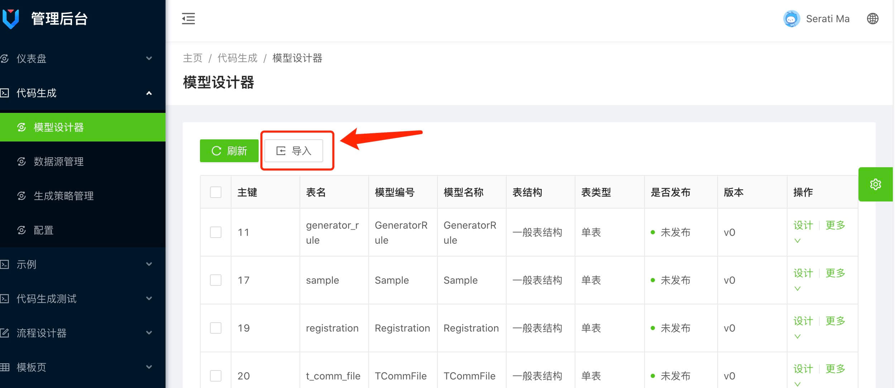
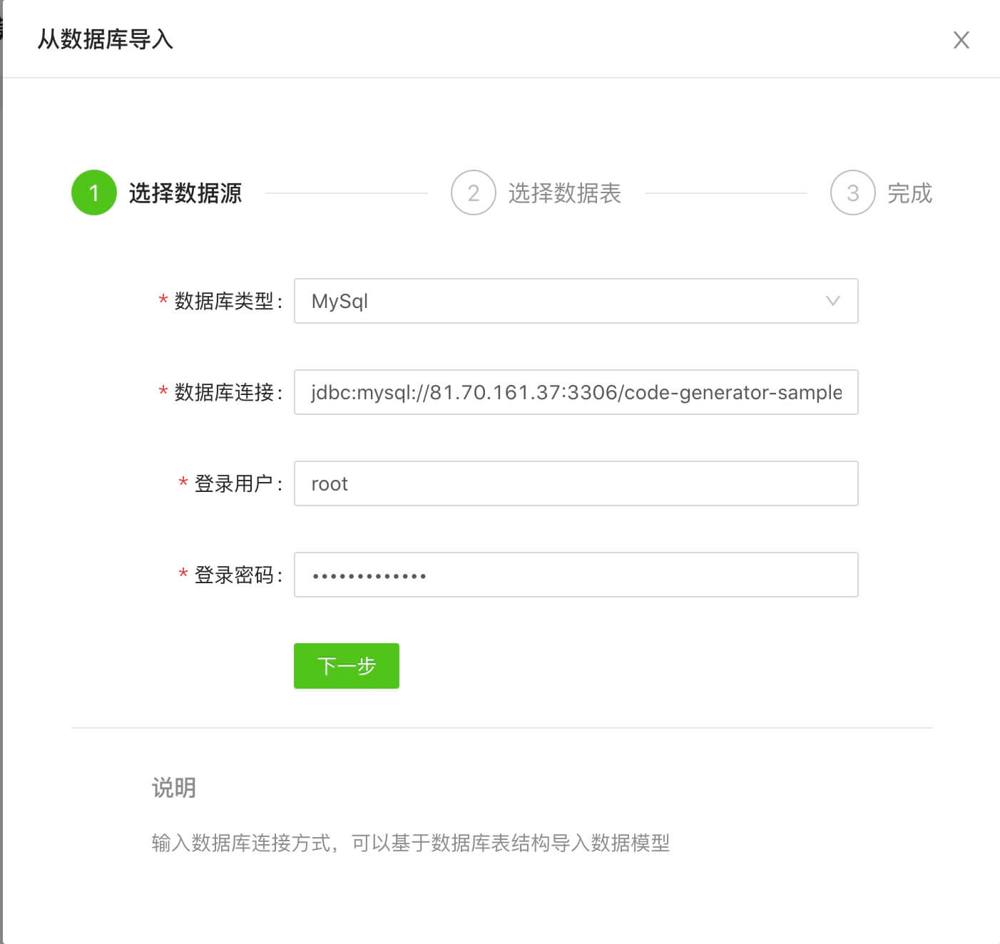
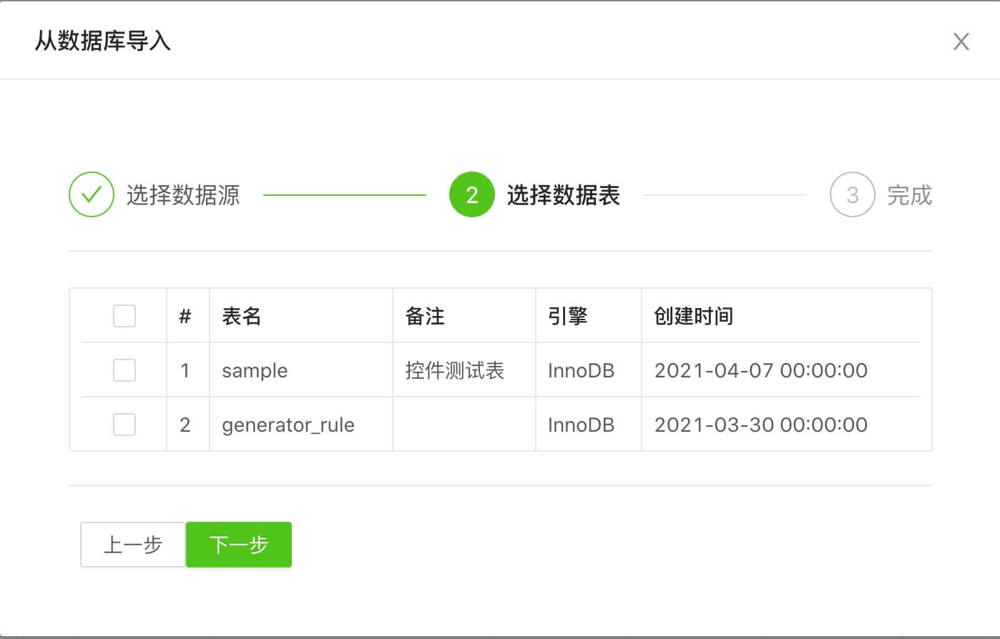
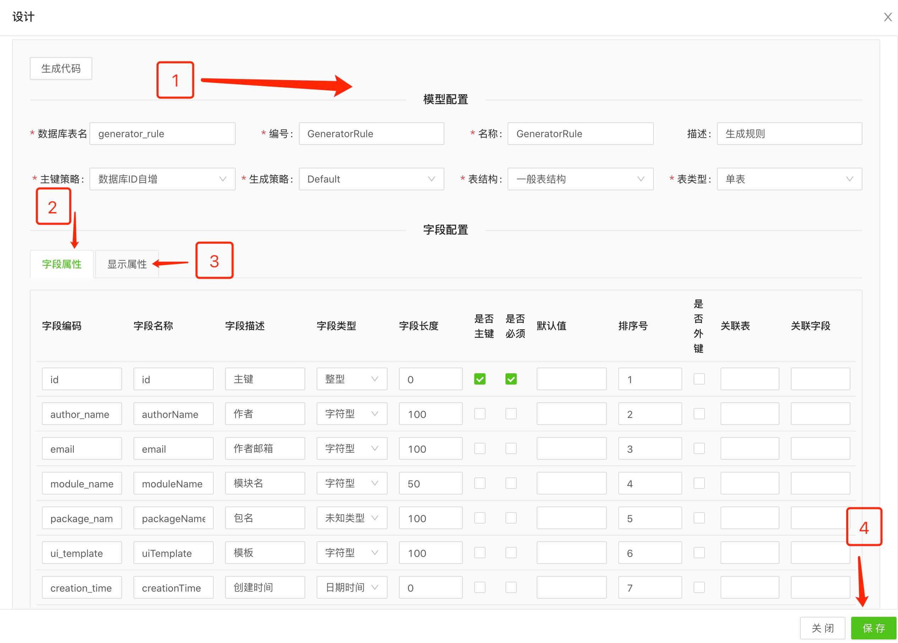

# 代码生成工具说明

## 1. 代码生成工具目的

代码生成工具支持对业务进行建模，并基于业务模型快速生成前后端代码，减少开发工作量。代码生成器由前端工程脚手架、后端工程脚手架、代码生成器三部分组成。由于代码生成器前期业务建模支持较少，因此代码生成器生成的代码需要拷贝到前后端工程中经过开发调试后进行发布。后续会逐步完善业务模型，提供更加细致的代码生成，并能提供pc web、移动端、小程序等不同环境的支持。

## 2. 使用方式

1. 获取前端脚手架,脚手架地址：`http://47.104.201.245:3000/LudanTech/vue-web-seed.git`

2. 获取后端脚手架(后续通过maven-archetype的方式进行创建),脚手架地址：``

3. 数据库表创建
   根据业务进行数据库表结构设计并在开发环境数据库中创建相应表结构
4. 生成模型
   基于快开工具提供的逆向工程通过数据库链接生成数据模型

   使用说明：

   step1: 模型设计器页面点击导入

   

   step2: 弹框填写数据库信息，连接数据库

   

   step3: 勾选数据库表导入

   

5. 代码生成配置

 使用说明：

 step1: 点击列表中 设计按钮， 弹框如下

 

 step2:

* 第一步：模型配置
* 第二步：字段属性配置（更新数据库表）
* 第三步：显示属性配置（控制页面上样式和控件等）
* 第四步：点击保存，更新到数据库

6. 生成代码

 点击列表-【更多】- 【下载代码】按钮生成代码

7. 拷贝代码到前后端工程

 前端拷贝路径： `/src/views`
   配置新页面url： `/src/config/router.config.js` 文件下配置

8. 完成
